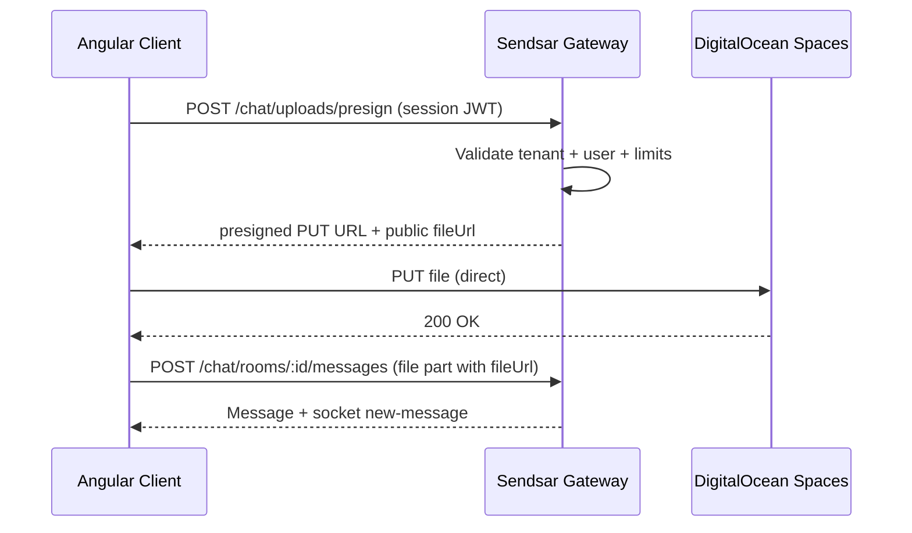

# Sendsar Angular UI Kit — Parity Roadmap (Phases 1–6)

Plan to bring `@sendsar/chat-uikit-angular` to **CometChat-class** coverage while keeping integration **developer-friendly**: tenants never run their own object storage or upload plumbing — **Sendsar gateway mints presigned URLs** and the browser uploads directly to **DigitalOcean Spaces**.

**Scope:** Angular first (React uikit deferred). Work spans `sendsar-monorepo` (gateway + SDK) and `sendsar-uikit-angular` (components + sample app).

**Baseline (today):** Core 1:1 + group chat, typing, presence (DM), reactions, edit/delete, read receipts (1:1), message pagination, mobile layout. Demo-only image upload (base64 ≤ 200 KB).

---

## Principles

| Principle | Detail |
|-----------|--------|
| **Uploads are Sendsar’s job** | Session JWT → gateway presign → client PUT to Spaces → message uses CDN URL. Tenant BFF only mints chat JWT. |
| **Gateway-first** | New capabilities land in gateway + `@sendsar/chat-sdk-javascript`, then Angular uikit consumes them. |
| **Session-scoped client APIs** | Upload presign, search, room detail, calls — callable with the **same JWT** the chat client already has. |
| **Incremental shipping** | Each phase is independently demo-able in `sample-app`. |

---

## Architecture — Media upload (all phases reference this)

```text
[ Angular Client / SDK ]
        |
        |  1. POST /v1/chat/uploads/presign
        |     { filename, mediaType, sizeBytes, roomId? }
        |     Authorization: Bearer <session-jwt>
        v
[ Sendsar Gateway ]
        |  validates: tenant limits, MIME allowlist, room membership (if roomId)
        |  2. returns { uploadUrl, fileUrl, uploadId, expiresAt, headers? }
        v
[ Angular Client ]
        |
        |  3. PUT uploadUrl (direct to Spaces, progress events)
        v
[ DigitalOcean Space ]
        |
        |  4. sendMessage({ parts: [{ type:'file', url: fileUrl, mediaType, filename }] })
        v
[ Sendsar Gateway ] → message stored + realtime broadcast
```



**Why not tenant BFF?** Developers already implement `POST /api/chat/session`. Asking them to also integrate S3/Spaces, CORS, virus scan hooks, and CDN URLs duplicates work and breaks the “drop in uikit” story.

---

## What already exists (reuse, don’t rebuild)

| Area | Status in monorepo |
|------|-------------------|
| **Thread replies (API)** | `parentMessageId` on send + `parentMessage` preview on `MessageDto` |
| **File message parts** | `{ type: 'file', url, mediaType, filename }` in gateway + SDK |
| **Room participants** | `RoomDetailDto.participants`, add/remove/patch participant endpoints |
| **Room list pagination** | `GET /chat/rooms?cursor=&limit=` — uikit not wired yet |
| **Calls (gateway + SDK)** | LiveKit signaling, `client.startCall()` / accept / decline / end |
| **Delivery + read cursors** | `peerLastDeliveredAt` / `peerLastReadAt` on messages response (1:1) |
| **User upsert** | `POST /users` (API key only) — **no list/search yet** |

---

## Phase overview

| Phase | Name | Primary repos | Depends on |
|-------|------|---------------|------------|
| **1** | Production file upload (Spaces presign) | monorepo gateway, SDK, uikit-angular | — |
| **2** | Threads & quoted replies | SDK, uikit-angular | — (API ready) |
| **3** | Search + user/group pickers | gateway, SDK, uikit-angular | Phase 1 optional |
| **4** | Group members panel | gateway (GET room), SDK, uikit-angular | — |
| **5** | Theming API | uikit-angular | — |
| **6** | Voice & video calls UI | monorepo calls, SDK, uikit-angular | LiveKit on gateway |

Recommended order: **1 → 2 → 4 → 3 → 5 → 6** (members panel before search is faster win; calls last because media UI is largest).

---

## Phase 1 — Production file upload (Sendsar-hosted)

**Goal:** Replace demo base64 upload with real files (images, video, audio, documents) up to tenant-configured limits.

### 1.1 Gateway — `MediaModule`

**New env (gateway):**

| Variable | Purpose |
|----------|---------|
| `SPACES_ENDPOINT` | e.g. `https://sgp1.digitaloceanspaces.com` |
| `SPACES_BUCKET` | Bucket name |
| `SPACES_ACCESS_KEY` / `SPACES_SECRET_KEY` | API keys (gateway only) |
| `SPACES_CDN_URL` | Public CDN origin for `fileUrl` (bucket CDN or custom domain) |
| `UPLOAD_PRESIGN_TTL_SECONDS` | Default `300` |

**New tenant settings** (`Tenant.settings.chat.media`):

```ts
{
  enabled: true,
  maxFileSizeBytes: 10_485_760,      // 10 MB default
  maxImageSizeBytes: 5_242_880,      // 5 MB
  allowedMimeTypes: ["image/*", "video/*", "audio/*", "application/pdf", ...],
  presignTtlSeconds: 300
}
```

**New endpoints (session JWT + API key where noted):**

| Method | Path | Auth | Body / response |
|--------|------|------|-----------------|
| `POST` | `/v1/chat/uploads/presign` | Session JWT | In: `{ filename, mediaType, sizeBytes, roomId? }` → Out: `{ uploadId, uploadUrl, fileUrl, method: 'PUT', headers?, expiresAt }` |
| `POST` | `/v1/chat/uploads/complete` | Session JWT | Optional v1.1: confirm upload + virus-scan hook before message send |
| `DELETE` | `/v1/chat/uploads/:uploadId` | Session JWT | Abort / garbage-collect orphaned uploads |

**Object key layout:**

```text
{tenantId}/uploads/{yyyy}/{mm}/{uploadId}/{sanitizedFilename}
```

**Validation rules:**

- Reject `sizeBytes` over tenant limit before presigning.
- If `roomId` provided: caller must be room participant (prevents cross-room URL farming).
- Sanitize filename; block `../` and null bytes.
- Rate limit: `RATE_LIMIT_ACTION.UPLOAD_PRESIGN` per tenant + per user.

**Implementation sketch:**

- `apps/gateway/src/media/media.module.ts`
- `SpacesPresignService` using `@aws-sdk/client-s3` + `@aws-sdk/s3-request-presigner` (S3-compatible API).
- Optional `Upload` table in Prisma: `id, tenantId, userId, roomId?, objectKey, mediaType, sizeBytes, status, expiresAt` for audit + orphan cleanup cron.

### 1.2 SDK — `@sendsar/chat-sdk-javascript`

```ts
// New types
type PresignUploadParams = { filename: string; mediaType: string; sizeBytes: number; roomId?: string };
type PresignUploadResult = { uploadId: string; uploadUrl: string; fileUrl: string; expiresAt: string; headers?: Record<string,string> };

// SendsarClient
presignUpload(params: PresignUploadParams): Promise<PresignUploadResult>;

uploadFile(params: PresignUploadParams & { file: Blob | File; onProgress?: (pct: number) => void }): Promise<{ fileUrl: string; mediaType: string; filename: string }>;
```

`uploadFile` = presign → `fetch(uploadUrl, { method:'PUT', body: file })` → return metadata for `sendMessage`.

### 1.3 Angular uikit

| Component | Work |
|-----------|------|
| `SendsarComposerComponent` | File picker (image/video/audio/docs per tenant MIME); call `chat.uploadFile()`; progress bar; remove 200 KB / data-URL path |
| `SendsarMessageListComponent` | Video `<video controls>`, audio player, doc card with size/icon |
| `SendsarChatService` | Expose `uploadFile()` delegating to SDK |

**Sample app:** No BFF changes for upload — composer uses session JWT against gateway directly.

### 1.4 Acceptance criteria

- [ ] Upload 5 MB PNG via sample app; message appears with CDN URL (not base64).
- [ ] Upload rejected when over tenant `maxFileSizeBytes` with clear error.
- [ ] Non-participant cannot presign with another room’s `roomId`.
- [ ] `npm run build` passes; CI green.
- [ ] Docs: `apps/docs/setup/media.md` + SDK reference.

**Estimate:** 1.5–2 weeks (gateway + SDK + uikit + staging Spaces bucket).

---

## Phase 2 — Threads & quoted replies

**Goal:** Reply to a specific message; optional thread side-panel (CometChat `thread-header` + thread `message-list`).

### 2.1 Gateway (minimal)

Already supports `parentMessageId`. **Add:**

| Enhancement | Detail |
|-------------|--------|
| `GET /chat/rooms/:id/messages/:messageId/replies` | Cursor-paginated thread replies (`parentId = messageId`) |
| `replyCount` on parent messages | Optional denormalized count on list (or compute in query) |
| Socket | Thread replies still emit `new-message` on parent room (no new event type) |

### 2.2 SDK

- `getThreadReplies(roomId, parentMessageId, params?)`
- `SendMessageParams.parentMessageId` — **already typed**; ensure Angular uses it.
- Helpers: `isThreadReply(message)`, `formatQuotedPreview(parentMessage)`.

### 2.3 Angular uikit

| UI | Behavior |
|----|----------|
| **Quoted reply bar** | Composer shows preview when replying; clear on send/cancel |
| **Message actions** | “Reply” on hover/long-press |
| **Inline quote** | Render `parentMessage.previewText` above bubble (tap scrolls to parent) |
| **Thread panel** | Optional right drawer: `SendsarThreadPanelComponent` — header + filtered message list (`parentMessageId` set) |
| **Shell** | `replyTo` signal; pass `parentMessageId` into composer + message list filter mode |

**Not in v2.0:** Slack-style thread inbox separate from main room list.

### 2.4 Acceptance criteria

- [ ] Reply in DM and group; quote visible on bubble.
- [ ] Thread panel shows replies only for selected parent.
- [ ] Scroll-to-parent from quote chip.
- [ ] Edit/delete/reactions work on thread replies.

**Estimate:** 1–1.5 weeks (mostly uikit; small gateway list endpoint).

---

## Phase 3 — Search + user/group pickers

**Goal:** Discover users, rooms, and messages from inside the uikit — not hardcoded `environment.ts` users.

### 3.1 Gateway — new search APIs

| Method | Path | Auth | Notes |
|--------|------|------|-------|
| `GET` | `/v1/users` | Session JWT | `?q=&limit=&cursor=` — search by `id`, `username`, display metadata |
| `GET` | `/v1/chat/search` | Session JWT | `?q=&scope=rooms\|messages\|all&participantId=&limit=` |
| `GET` | `/v1/chat/rooms/:id` | Session JWT | **Missing today** — return `RoomDetailDto` (participants included) |

**Indexing:** Start with Postgres `ILIKE` + `participantId` scope (rooms user belongs to). Later: dedicated search index if needed.

**Security:** Session JWT can only search users/rooms visible to that tenant; message search scoped to participant’s rooms.

### 3.2 SDK

```ts
searchUsers(params: { q: string; limit?: number; cursor?: string })
searchChat(params: { q: string; scope?: 'rooms' | 'messages' | 'all'; limit?: number; cursor?: string })
getRoom(roomId: string): Promise<RoomDetail>
```

### 3.3 Angular uikit

| Component | Work |
|-----------|------|
| `SendsarSearchComponent` | Debounced input; tabs Users / Chats / Messages |
| `SendsarUserPickerComponent` | Reusable in new-chat dialog + mention prep (future) |
| `SendsarChatShellComponent` | Search icon in sidebar header; overlay results |
| **Sample app** | Remove hardcoded user list for new-chat; use `searchUsers` + optional BFF seed on first session |

### 3.4 Acceptance criteria

- [ ] Search finds demo users by display name.
- [ ] Search finds rooms by title.
- [ ] Message search returns snippets with room link.
- [ ] New-chat DM flow uses picker, not static array.

**Estimate:** 2 weeks (gateway search + uikit components).

---

## Phase 4 — Group members panel

**Goal:** CometChat-style group info: member list, roles, presence, add/remove (where permitted).

### 4.1 Gateway

- **`GET /v1/chat/rooms/:id`** — expose existing `getRoomDetailOrThrow` (today only returned from create/patch/participant mutations).
- Participant APIs already exist: `POST/DELETE/PATCH .../participants`.

### 4.2 SDK

```ts
getRoom(roomId: string): Promise<RoomDetail>
addParticipant(roomId, params)
removeParticipant(roomId, userId)
updateParticipant(roomId, userId, params)
```

Wire to existing REST paths in `rest.ts`.

### 4.3 Angular uikit

| Component | Work |
|-----------|------|
| `SendsarGroupInfoComponent` | Sheet/modal: room name, avatar, member count |
| `SendsarGroupMembersComponent` | List with presence dots, role badges (OPERATOR / MEMBER) |
| **Shell** | Info button in thread header for groups; wire add-member via user picker (Phase 3) |
| **Operator actions** | Add/remove member when `participant.role === 'OPERATOR'` |

### 4.4 Acceptance criteria

- [ ] Open group info from thread header.
- [ ] See all members with online status.
- [ ] Operator can add member from search picker.
- [ ] Remove member updates room + sidebar.

**Estimate:** 1 week.

---

## Phase 5 — Theming API

**Goal:** CometChat-style customization without forking components — CSS variables, density, dark mode.

### 5.1 Design tokens (uikit-only)

Define `SendsarTheme` interface:

```ts
type SendsarTheme = {
  colorScheme?: 'light' | 'dark' | 'system';
  colors?: {
    primary?: string;
    surface?: string;
    bubbleSelf?: string;
    bubbleOther?: string;
    border?: string;
    danger?: string;
  };
  radius?: { sm?: string; md?: string; lg?: string };
  fontFamily?: string;
  density?: 'comfortable' | 'compact';
};
```

**Delivery:**

- `provideSendsar({ theme })` merges with defaults.
- `SENDSAR_THEME` injection token; `SendsarThemeService` applies CSS variables on `:root` or host element.
- All component CSS uses `var(--sc-*)` tokens (migrate hardcoded colors in phases 1–4 as you touch files).

### 5.2 Angular uikit

| Item | Work |
|------|------|
| **Dark mode** | `prefers-color-scheme` + manual override |
| **Host attribute** | `[attr.data-sc-theme]` on shell for scoped overrides |
| **Docs** | Theme table in README + docs site page |
| **Sample app** | Toggle in demo top bar |

**Optional v5.1:** Template outlets for avatar / message bubble (CometChat slots) — defer until tokens ship.

### 5.3 Acceptance criteria

- [ ] Switch light/dark in sample app without rebuild.
- [ ] Primary brand color changes all accents via one config object.
- [ ] Components remain usable with zero theme config (sensible defaults).

**Estimate:** 1 week (mostly CSS refactor + provider).

---

## Phase 6 — Voice & video calls UI

**Goal:** Wire existing LiveKit gateway + SDK call methods into Angular uikit.

**Prerequisite:** Gateway deployed with `calls.enabled: true` and LiveKit env (see `apps/gateway/CALLS.md`).

### 6.1 Packages

| Option | Recommendation |
|--------|----------------|
| A) Calls inside uikit | `@sendsar/chat-uikit-angular` optional peer `@livekit/components` |
| B) Separate package | `@sendsar/calls-uikit-angular` — **preferred** to keep chat bundle lean |

### 6.2 SDK (already largely done)

Confirm / document in Angular context:

- `startCall`, `acceptCall`, `declineCall`, `endCall`, `leaveCall`
- Socket listeners: `CALL_INVITE`, `CALL_ACCEPTED`, `CALL_DECLINED`, `CALL_ENDED`
- `data-call` parts in message list via `parseCallLogPart()`

### 6.3 Angular components (new)

| Component | Behavior |
|-----------|----------|
| `SendsarCallButtonComponent` | Audio / video buttons in thread header |
| `SendsarIncomingCallComponent` | Ringing modal with accept/decline |
| `SendsarActiveCallComponent` | LiveKit room view; mute/camera/hang up |
| `SendsarCallLogBubbleComponent` | Render `data-call` history in message list |

**Shell integration:** Subscribe to call socket events when session connects; overlay call UI above thread.

### 6.4 Sample app

- Enable calls against staging gateway with LiveKit.
- Document env: sample app still **no** `LIVEKIT_*` — only gateway.

### 6.5 Acceptance criteria

- [ ] 1:1 video call from sample app; callee sees ring UI.
- [ ] Call end posts `data-call` row in thread (rendered via `SendsarCallLogBubbleComponent` with duration).
- [ ] Live call overlay shows `mm:ss` duration while connected.
- [ ] Ring/ringback/end tones; minimize-to-chip; speaker toggle; peer name/avatar; tap history to redial; busy ignores second invite.
- [ ] Group call join (auto-active) works for 3+ members.
- [ ] Chat works when `calls.enabled: false` (buttons hidden).

**Phase 6 Telegram polish (done in UIKit/SDK):** ring/ringback/end tones; peer name+avatar; minimize-to-chip; speaker toggle; busy-while-in-call; tap call-log to redial.

**Estimate:** 2–3 weeks (LiveKit Angular integration + polish).

---

## Cross-cutting work (all phases)

| Item | Action |
|------|--------|
| **Room list pagination** | Wire `nextCursor` in `SendsarConversationListComponent` (quick win, any phase) |
| **Avatar URLs** | Render `room.avatarUrl` + user avatar when search exposes them |
| **Delivery ticks** | Use `peerLastDeliveredAt` for ✓ vs ✓✓ in 1:1 (gateway already returns) |
| **Tests** | Component tests per phase; Playwright e2e in sample app before Phase 6 |
| **Docs** | Update `docs.sendsar.com` ui-kit section per phase |
| **npm** | Publish SDK bumps before uikit features that depend on new client methods |

---

## Suggested timeline

```text
Week 1–2   Phase 1  Upload (gateway + SDK + composer)
Week 3     Phase 2  Threads / quotes
Week 4     Phase 4  Group members (+ GET room)
Week 5–6   Phase 3  Search + pickers
Week 7     Phase 5  Theming
Week 8–10  Phase 6  Calls UI
```

Parallelizable: Phase 5 can start during Phase 3–4 (CSS-only). Phase 6 should start only after Phases 1–2 stable.

---

## File map (where code will land)

### Monorepo (`sendsar-monorepo`)

```text
apps/gateway/src/media/           # Phase 1 — presign, Spaces
apps/gateway/src/chat/            # Phase 2–4 — GET room, thread replies, search
packages/chat-sdk-javascript/     # All phases — client methods
apps/docs/setup/media.md          # Phase 1 docs
apps/docs/ui-kit/angular/         # Per-phase integrator docs
```

### Angular uikit (`sendsar-uikit-angular`)

```text
projects/sendsar-uikit/src/lib/
  services/sendsar-chat.service.ts       # SDK facade extensions
  services/sendsar-theme.service.ts      # Phase 5
  components/sendsar-composer/           # Phase 1, 2
  components/sendsar-message-list/       # Phase 1, 2, 6
  components/sendsar-thread-panel/       # Phase 2 (new)
  components/sendsar-search/             # Phase 3 (new)
  components/sendsar-group-info/         # Phase 4 (new)
projects/calls-uikit/                    # Phase 6 (optional new project)
projects/sample-app/                     # Demo each phase
docs/PARITY-ROADMAP.md                   # This file
```

---

## Developer experience target (end state)

After Phase 6, integrators do:

```ts
provideSendsar({
  fetchSession: () => fetch('/api/chat/session').then((r) => r.json()),
  theme: { colorScheme: 'system', colors: { primary: '#2563eb' } },
})
```

```html
<sc-chat-shell
  [users]="userDirectory"
  [features]="{ uploads: true, threads: true, search: true, calls: true }"
/>
```

No Spaces credentials in the tenant app. No upload proxy. No LiveKit keys in the browser beyond what the gateway returns per call.

---

## Open decisions (resolve before Phase 1 coding)

| # | Question | Recommendation |
|---|----------|----------------|
| 1 | Virus scan on upload? | Defer; hook at `uploads/complete` in v1.1 |
| 2 | Public vs signed `fileUrl`? | CDN public URL for chat attachments; private bucket + short-lived GET if compliance requires |
| 3 | Image transforms (thumbnails)? | Phase 1.5 — optional gateway worker or Spaces imgproxy |
| 4 | Calls package split? | Separate `@sendsar/calls-uikit-angular` |
| 5 | Message search full-text engine | Postgres first; OpenSearch later if scale demands |

---

## References

- Gateway calls: `sendsar-monorepo/apps/gateway/CALLS.md`
- Thread API tests: `chat.service.spec.ts` (`parentMessageId`)
- Current Angular uikit: `sendsar-uikit-angular/README.md`
- CometChat comparison: chat session notes (Phases 1–6 gap analysis)
